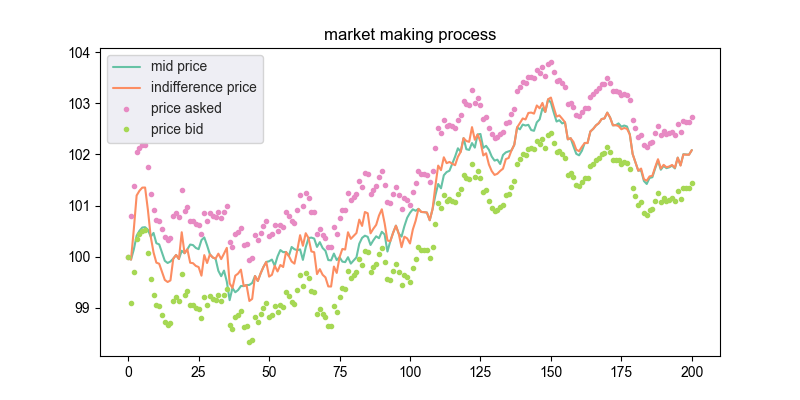
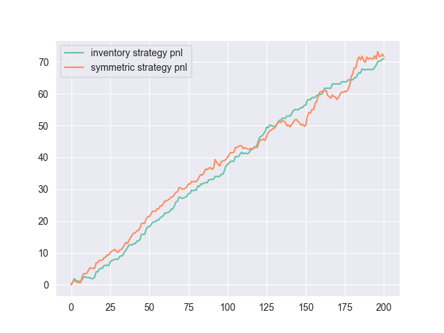
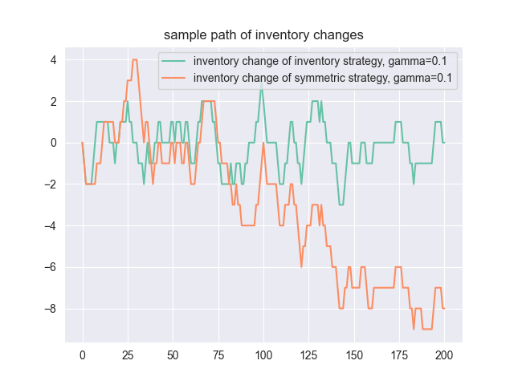
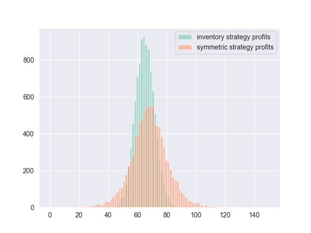

# Avellaneda-Stoikov-MarketMaking

The implementation uses the same settings as in the paper of Avellaneda and Stoikov, it will run 10000 simulations and plot the histogram of profits over simulations, below are results:

- gamma=0.1, sample path, pnl and inventory level, profits histogram.

